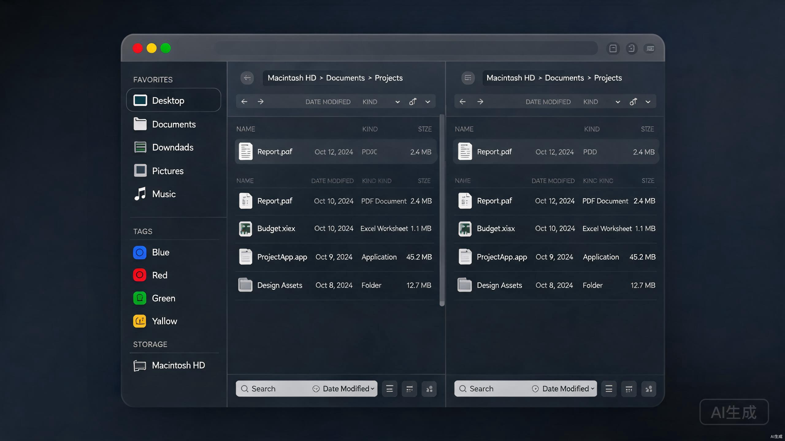

<div align="center">


# FlowFinder

macOS 原生文件管理器 — Swift & AppKit · Rust Core · 玻璃态双栏


🌐 [官方网站](https://waltxao.github.io/FlowFinder/) · 📦 [下载最新版](https://github.com/waltxao/FlowFinder/releases) · 📖 [开发者文档](docs/DEVELOPMENT.md) · 📝 [重构日志](docs/MIGRATION_LOG.md)

</div>

---

## 简介

FlowFinder 是一款专为 macOS 打造的原生文件管理器，采用 **Swift & AppKit** 构建用户界面，**Rust Core** 提供高性能后端引擎，通过 FFI（C ABI）实现跨语言调用。相较于前代 Tauri + React 版本，原生架构带来了 10-30 倍的目录读取性能提升、更低的内存占用，以及与 macOS Finder 一致的视觉和交互体验。



> 📌 以上为产品示意图（mockup），实际界面以最新版本为准。

### 核心亮点

- **纯原生 UI**：Swift & AppKit 构建，NSVisualEffectView 系统级毛玻璃，完全匹配 macOS 视觉语言
- **高性能 Rust Core**：getattrlistbulk 批量读取、BLAKE3 哈希、rayon 并行处理，性能远超 WebView 方案
- **Finder 级交互**：原生拖拽（同卷移动 / 跨卷复制 / Cmd 切换）、Quick Look 空格预览、双栏布局
- **跨面板文件操作**：一键复制 / 移动到对侧面板，文件夹可在对侧打开（⌘⇧C / ⌘⇧X）
- **APFS CoW 复制**：clonefile 零拷贝复制，APFS 卷内复制瞬时完成
- **AI 智能打标**：多模型支持（OpenAI / Claude / Ollama），标签与 macOS 原生标签双向同步
- **玻璃态双视图**：列表视图（可拖列宽 + 排序）+ 网格视图（缩略图），跟随系统深浅色主题

---

## 功能特性

### 文件浏览

| 功能 | 描述 |
|------|------|
| 双栏布局 | 左右独立导航，可拖拽分隔条调整比例 |
| 统一工具栏 | 后退 / 前进 / 上一级、面包屑、正则搜索、视图切换，嵌入标题栏 |
| 双视图模式 | 表格视图（可拖列宽 + 点击排序）+ 网格视图（缩略图） |
| 文件详情栏 | 选中文件时底部显示缩略图、类型、大小、日期、标签等信息 |
| 跨面板操作 | 复制到对侧（⌘⇧C）、移动到对侧（⌘⇧X）、在对侧打开文件夹 |
| 原生右键菜单 | 打开、复制、剪切、粘贴、重命名、删除、新建文件夹 |
| 面板激活 | 点击任意空白区域即激活对应面板，无需键盘切换 |

### macOS 原生体验

- **原生毛玻璃**：NSVisualEffectView 系统级毛玻璃材质，自动跟随系统深浅色主题
- **Quick Look 预览**：QLPreviewPanel 原生浮动预览，空格键触发
- **混合缩略图引擎**：QLThumbnailGenerator + SQLite 缓存，P0/P1 双队列优先级调度
- **Spotlight 搜索**：NSMetadataQuery 异步搜索 + Channel 流式推送
- **FSEvents 实时监控**：文件系统变更自动刷新目录
- **getattrlistbulk 批量读取**：单次系统调用获取目录全部元数据
- **clonefile CoW 复制**：APFS 卷零拷贝文件复制
- **原生拖拽**：NSDraggingSource/Destination，同卷移动、跨卷复制、Cmd 键切换

### 侧边栏

- **个人收藏**：任意文件夹可拖拽添加到收藏夹
- **存储设备**：磁盘分组显示，自动排除系统隐藏卷，支持 SMB/UNC 网络挂载
- **标签管理**：标签分类树，颜色圆点标识，AI 标签与 macOS 原生标签双向同步
- **可折叠区段**：所有区段可折叠，状态持久化

### 重复文件检测

- **BLAKE3 哈希**：高速加密哈希，比 MD5 快 10 倍
- **三阶段检测**：按大小分组 → 部分哈希（头尾 4KB）→ 完整哈希确认
- **实时进度**：扫描进度流式推送，支持取消
- **安全删除**：移入废纸篓（可恢复），每组强制保留一个文件
- **SQLite 缓存**：基于 mtime 增量扫描，避免重复哈希计算

### AI 智能打标

- **多模型支持**：OpenAI / Claude / Ollama / 自定义 API
- **隐私隔离**：仅发送文件名 + 扩展名 + 大小，绝不发送文件内容或绝对路径
- **本地规则优先**：无网络时自动使用扩展名分类规则
- **Finder 原生兼容**：标签写入 macOS `com.apple.metadata:_kMDItemUserTags` 扩展属性

### 任务调度中心

- **统一调度**：复制 / 移动 / 删除 / 查重统一队列管理
- **生命周期控制**：支持暂停 / 恢复 / 取消 / 优先级调整
- **进度可视化**：实时进度条 + 当前文件显示

### SMB 网络共享

- **渐进式加载**：先加载文件骨架，异步获取元数据，批量推送
- **目录缓存**：LRU + TTL，前进 / 后退即时切换
- **批量文件操作**：rayon 并行池，进度流式推送
- **网络韧性**：SMB 断连自动检测 + 重连 + 全链路重试

---

## 性能对比

FlowFinder Native 相较于原 Tauri + React 版本有显著性能提升：

| 指标 | 原版（Tauri） | 新版（Native） | 提升 |
|------|--------------|----------------|------|
| 目录列表（冷） | ~15-30 ms | ~0.5-1.0 ms | **10-30x** |
| 目录列表（热） | ~5-10 ms | ~0.2-0.5 ms | **10-20x** |
| 内存占用 | ~50-100 MB | ~20-30 MB | **2-3x** |
| 启动时间 | ~2-3s | ~0.5s | **4-6x** |
| 二进制大小 | ~80-100 MB | ~15-20 MB | **5-6x** |

---

## 下载与安装

### 系统要求

- **macOS** 13.0+（Apple Silicon / Intel）
- 无需额外运行时依赖

### 下载方式

前往 [Releases](https://github.com/waltxao/FlowFinder/releases) 页面下载最新版本：

| 文件 | 说明 | 适用架构 |
|------|------|---------|
| `FlowFinder-0.6.0-alpha.dmg` | DMG 安装镜像 | Apple Silicon |
| `FlowFinder-0.6.0-alpha.zip` | ZIP 压缩包（含 .app） | Apple Silicon |

### 安装步骤

1. 下载 `.dmg` 或 `.zip` 文件
2. 若为 DMG：双击挂载，将 FlowFinder 拖入「应用程序」文件夹
3. 若为 ZIP：解压后直接双击运行，或拖入「应用程序」文件夹
4. 首次启动若提示「无法验证开发者」，前往「系统设置 → 隐私与安全性」点击「仍要打开」

> ⚠️ 当前为 alpha 版本，建议不要用于生产环境关键数据操作。

---

## 架构设计

```
+--------------------------------------------------+
|  Swift & AppKit UI Layer                         |
|  - NSTableView / NSCollectionView                |
|  - NSSplitView 双栏布局                          |
|  - NSVisualEffectView 毛玻璃                     |
|  - QLPreviewPanel Quick Look                     |
|  - Spotlight NSMetadataQuery                     |
|  - NSDraggingSource/Destination 原生拖拽         |
+--------------------------------------------------+
                        |
                        | FFI (C ABI)
                        v
+--------------------------------------------------+
|  Rust Core Engine (cdylib)                       |
|  - bulk_read: getattrlistbulk(2) 批量读取        |
|  - scanner: FileEntrySkeleton + 元数据            |
|  - dedup_engine: 三阶段 BLAKE3 去重              |
|  - cow_copy: APFS copy-on-write 克隆             |
|  - dir_cache: LRU + TTL 目录缓存                 |
|  - task_scheduler: 统一任务调度                  |
|  - search_engine: 正则 / 通配符搜索              |
|  - sqlite_cache: 标签 / 缩略图持久化             |
|  - path_guard: 路径穿越防护                      |
|  - volumes: 卷管理                               |
+--------------------------------------------------+
```

### 技术栈

| 层 | 技术 | 版本 |
|----|------|------|
| UI 框架 | Swift & AppKit | 5.9+ |
| 后端引擎 | Rust（cdylib） | 2021 edition |
| 数据库 | rusqlite (bundled SQLite) | 0.32 |
| 哈希 | BLAKE3 + xxHash64 | - |
| 并行 | rayon | 1.10 |
| macOS 原生 | NSVisualEffectView / QLThumbnailGenerator / FSEvents / Spotlight | - |
| macOS 标签 | xattr + plist | - |

---

## 开发指南

### 环境要求

- **macOS** 13.0+（Apple Silicon 或 Intel）
- **Xcode** 15+（含 Swift 5.9+）
- **Rust** 1.75+（通过 `rustup` 安装）
- **Xcode Command Line Tools**（`xcode-select --install`）

### 快速开始

```bash
# 克隆仓库
git clone https://github.com/waltxao/FlowFinder.git
cd FlowFinder

# 一键环境配置（安装依赖、配置工具链）
make setup

# 构建全部（Rust Core + Swift 项目）
make build

# 开发模式运行
make run
```

### 手动构建

```bash
# 1. 构建 Rust Core 库
cd rust-core
cargo build --release

# 2. 构建 Swift 项目
cd ../FlowFinderNative
xcodebuild -project FlowFinderNative.xcodeproj \
           -scheme FlowFinderNative \
           -configuration Release \
           -destination 'platform=macOS'

# 3. 产物位于 build/Release/FlowFinderNative.app
```

### 测试

```bash
# 运行全部测试
make test

# 仅 Rust 单元测试
make rust-test

# 仅 Swift 单元测试
make swift-test

# 集成测试
make integration-test

# 性能基准测试
bash scripts/benchmark.sh
```

### 项目结构

```
FlowFinder/
├── rust-core/                    # Rust 核心引擎（cdylib）
│   ├── src/
│   │   ├── lib.rs                # 库入口
│   │   ├── ffi/                  # FFI 导出层
│   │   └── core/                 # 核心模块
│   │       ├── bulk_read.rs      # getattrlistbulk 批量读取
│   │       ├── scanner.rs        # 文件扫描 + 元数据
│   │       ├── dedup_engine.rs   # 三阶段重复检测
│   │       ├── cow_copy.rs       # APFS CoW 复制
│   │       ├── dir_cache.rs      # LRU 目录缓存
│   │       ├── task_scheduler.rs # 任务调度器
│   │       ├── search_engine.rs # 搜索引擎
│   │       ├── sqlite_cache.rs   # SQLite 持久化
│   │       ├── path_guard.rs     # 路径安全
│   │       └── volumes.rs        # 卷管理
│   ├── include/
│   │   └── ff_ffi.h              # C 头文件（FFI 接口）
│   └── Cargo.toml
├── FlowFinderNative/             # Swift Xcode 项目
│   ├── FlowFinderNative/
│   │   ├── App/                  # 应用入口
│   │   ├── Bridge/               # Swift ↔ Rust 桥接层
│   │   ├── Model/                # 数据模型
│   │   ├── UI/                   # UI 组件
│   │   │   ├── MainWindowController.swift
│   │   │   ├── FileListView.swift
│   │   │   ├── FileGridView.swift
│   │   │   ├── SidebarView.swift
│   │   │   ├── MainMenu.swift
│   │   │   └── ...
│   │   ├── Libraries/            # 编译后的 Rust 库
│   │   └── Resources/            # Info.plist
│   └── FlowFinderNative.xcodeproj
├── docs/                         # 文档
│   ├── images/                   # 截图 / mockup
│   ├── MIGRATION_LOG.md          # 完整重构日志
│   ├── MIGRATION_PLAN.md         # 迁移计划
│   └── VERIFICATION.md           # 验证清单
├── Makefile                      # 构建自动化
└── README.md
```

---

## 贡献指南

欢迎提交 Issue 和 Pull Request！请遵循以下规范：

1. **Issue**：提交 Bug 报告或功能请求时，请使用 Issue 模板并描述复现步骤
2. **Pull Request**：PR 标题遵循 Conventional Commits 规范（`feat:` / `fix:` / `docs:` / `refactor:`）
3. **代码风格**：Rust 使用 `cargo fmt` + `cargo clippy`，Swift 使用 SwiftFormat
4. **测试**：新增功能需附带单元测试，确保 `make test` 通过
5. **提交前**：运行 `make build && make test` 确保构建和测试通过

### 开发流程

```bash
# 1. Fork 并克隆仓库
git clone https://github.com/<your-username>/FlowFinder.git
cd FlowFinder

# 2. 创建功能分支
git checkout -b feat/your-feature

# 3. 开发并提交
git add . && git commit -m "feat: 添加新功能"

# 4. 推送并创建 PR
git push origin feat/your-feature
```

---

## 常见问题（FAQ）

### 安装与运行

**Q: 启动时提示「无法验证开发者」？**
A: 这是 macOS Gatekeeper 安全策略。前往「系统设置 → 隐私与安全性」，点击「仍要打开」即可。或使用 `xattr -cr /path/to/FlowFinder.app` 移除隔离属性。

**Q: 支持 Intel Mac 吗？**
A: 当前版本主要针对 Apple Silicon 优化。Intel Mac 理论可用，但未充分测试。后续版本将提供通用二进制。

**Q: 为什么最低系统要求是 macOS 13.0？**
A: 使用了 macOS 13+ 引入的 NSVisualEffectView 新材质和 QLThumbnailGenerator API。

### 功能与使用

**Q: 如何在双面板之间复制文件？**
A: 选中文件后，右键菜单选择「复制到另一面板」，或使用快捷键 ⌘⇧C。移动使用 ⌘⇧X。

**Q: AI 打标会上传文件内容吗？**
A: 不会。FlowFinder 仅发送文件名、扩展名和文件大小给 AI 模型，绝不发送文件内容或绝对路径。

**Q: 标签能与 macOS Finder 同步吗？**
A: 可以。标签写入 macOS `com.apple.metadata:_kMDItemUserTags` 扩展属性，在 Finder 中可见。

**Q: 重复文件检测支持网络驱动器（SMB）吗？**
A: 支持，但建议先启用目录缓存以提升性能。大目录扫描会触发哈希缓存机制。

### 开发相关

**Q: 为什么选择 Swift + Rust 而不是纯 Swift？**
A: Rust 提供更高效的系统级编程能力（BLAKE3、rayon 并行、零成本抽象），同时 Rust Core 可跨项目复用。Swift & AppKit 负责 UI 层以获得最佳原生体验。

**Q: Rust Core 如何被 Swift 调用？**
A: Rust 编译为 cdylib 动态库，通过 C ABI（FFI）暴露函数接口。Swift 侧通过 Bridging Header 调用。详见 `rust-core/include/ff_ffi.h`。

**Q: 如何参与开发？**
A: 参阅上方「贡献指南」，或查看 [迁移计划](docs/MIGRATION_PLAN.md) 了解待完成子项目。

---

## 路线图

| 阶段 | 状态 | 内容 |
|------|------|------|
| Phase 1: MVP | ✅ 完成 | 基础框架、文件操作、搜索、Quick Look |
| Phase 2: 增强 | ✅ 完成 | 重复检测、目录缓存、批量重命名 |
| Phase 3: 完善 | ✅ 完成 | 缩略图、设置面板、任务调度 |
| Phase 4: 收尾 | ✅ 完成 | 卷管理、玻璃态双栏重构 |
| Phase 5: 稳定 | 🔄 进行中 | 跨面板操作、性能优化、0.6.0-alpha 发布 |
| Phase 6: 正式版 | ⏳ 待开始 | 全面测试、文档完善、1.0 发布 |

---

## 变更日志

详见 [CHANGELOG.md](CHANGELOG.md)。

## 重构日志

从 Tauri + React 到 Swift & AppKit 的完整重构历史，详见 [重构日志](docs/MIGRATION_LOG.md)。

## 从原版迁移

原版 FlowFinder（Tauri + React）已搁置，迁移说明请参阅 [FlowFinder-T 迁移文档](https://github.com/waltxao/FlowFinder-T/blob/main/MIGRATION.md)。

---

## License

MIT License — 详见 [LICENSE](LICENSE) 文件。

---

<div align="center">

**[🌐 官方网站](https://waltxao.github.io/FlowFinder/)** · **[📦 下载](https://github.com/waltxao/FlowFinder/releases)** · **[📖 文档](docs/DEVELOPMENT.md)** · **[🐛 报告问题](https://github.com/waltxao/FlowFinder/issues)**

Made with ❤️ for macOS

</div>
